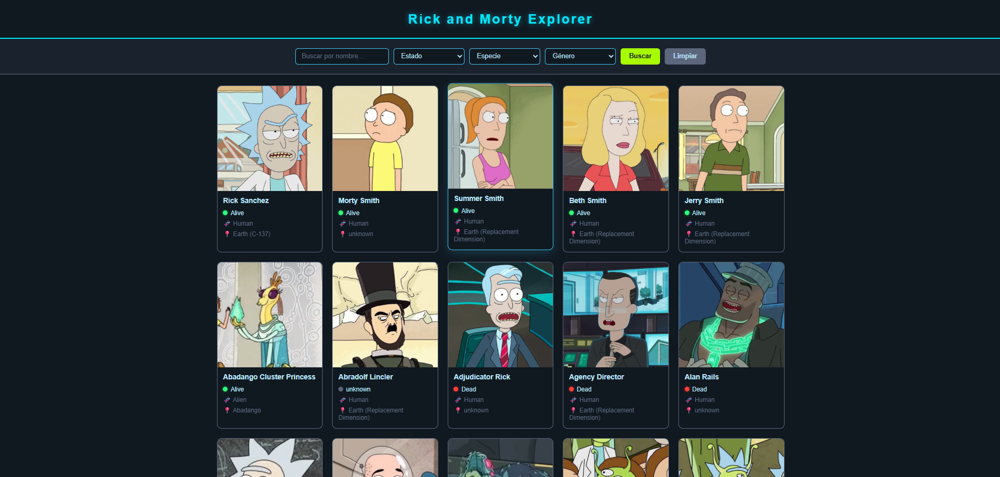
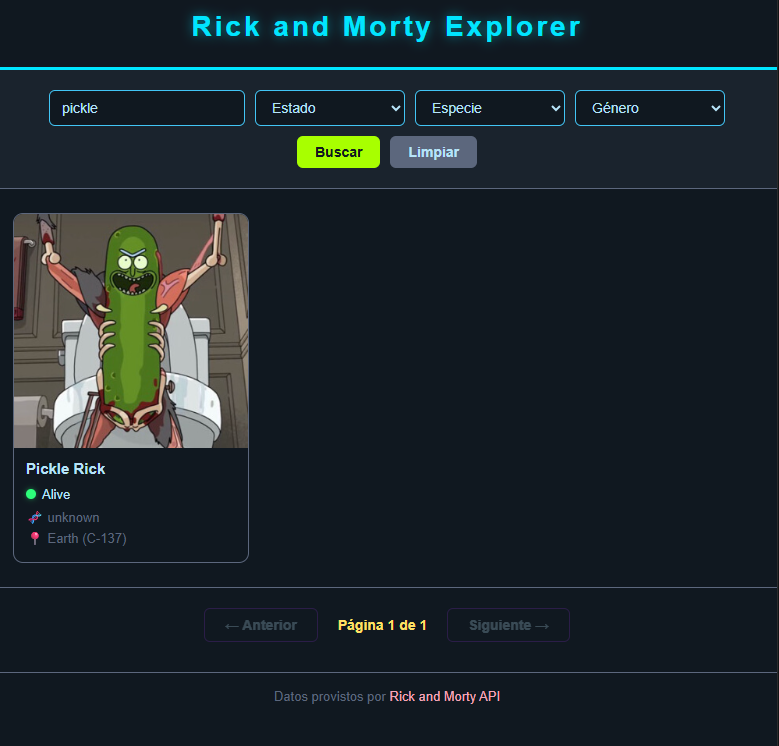

# Rick and Morty Explorer

Aplicación web para explorar los personajes de Rick and Morty consumiendo la API pública oficial.

---

## Integrantes

- Ilan Pitashny y Maximo Rojas

---

## Tecnologías utilizadas

- HTML5
- CSS3
- JavaScript (Vanilla)
- Rick and Morty API

---

## Funcionalidades

- Listado de personajes en cards con imagen, nombre, estado, especie y origen
- Indicador de estado con color (verde / rojo / gris)
- Búsqueda por nombre
- Filtros por estado, especie y género
- Paginación con indicador de página actual y total

---

## Estructura del proyecto

rick-and-morty-explorer/
├── index.html
├── css/
│   └── styles.css
├── js/
│   ├── api.js
│   ├── ui.js
│   └── main.js
└── README.md

---

## Cómo ejecutar el proyecto

1. Clonar el repositorio:
git clone https://github.com/Ilan-Py/TP-Rick-and-Morty-.git
2. Abrir la carpeta del proyecto
3. Abrir `index.html` directamente en el navegador (no requiere Live Server)

---

## API utilizada

Rick and Morty API — https://rickandmortyapi.com

Gratuita, sin registro, devuelve datos en formato JSON.

---

## Capturas de pantalla

---

